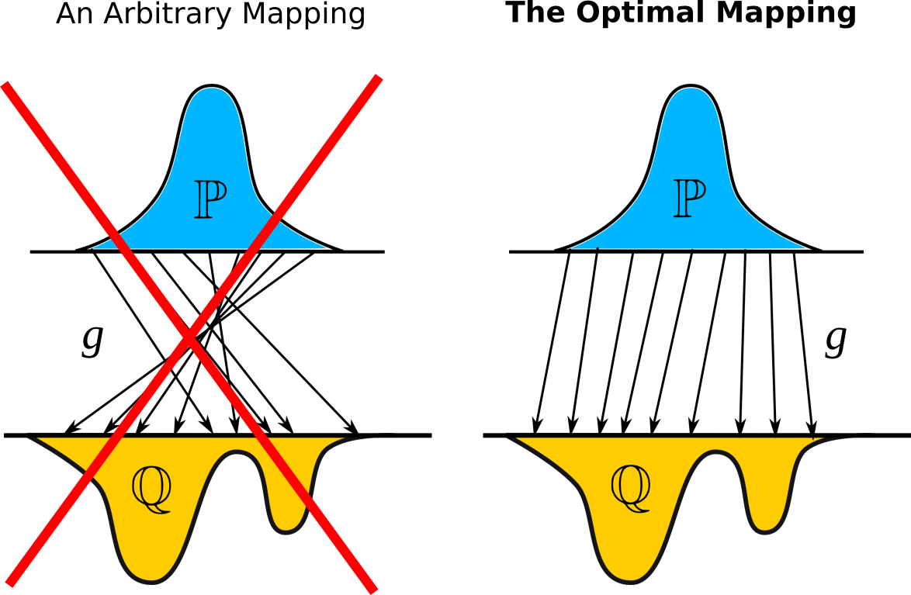
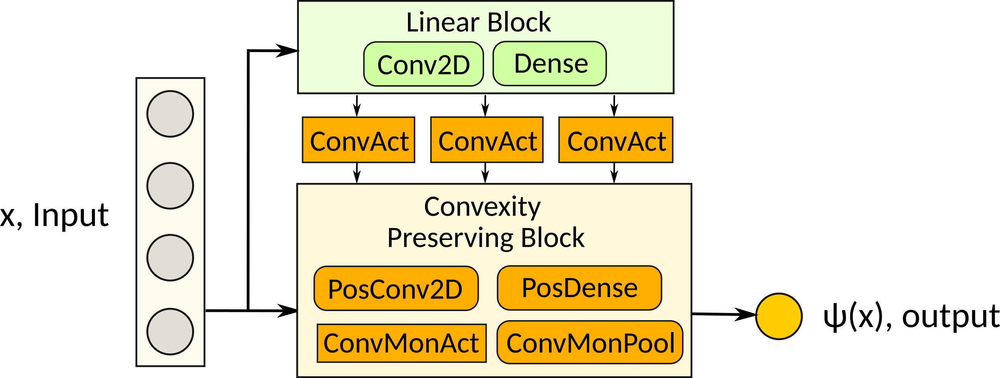
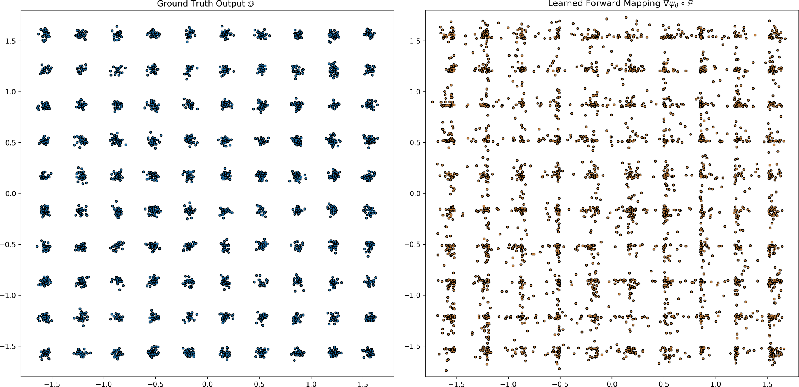
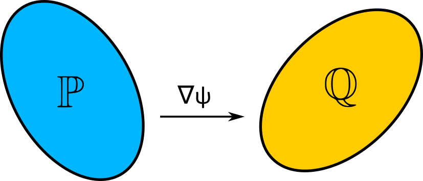
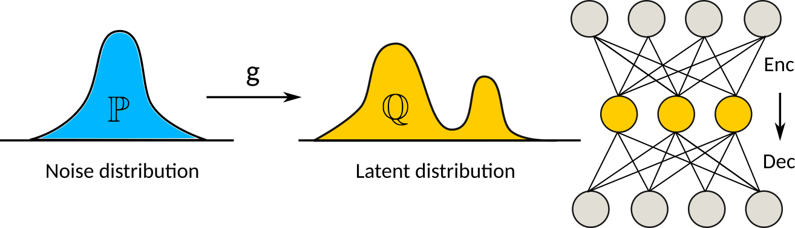
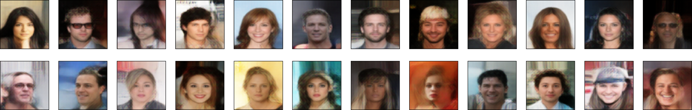
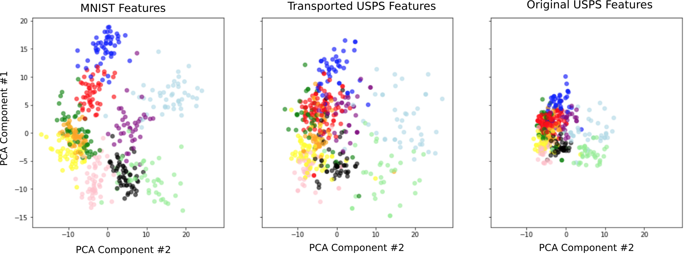
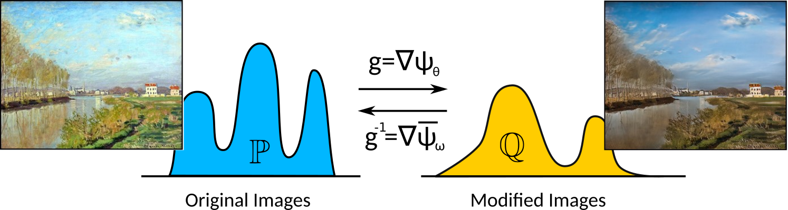
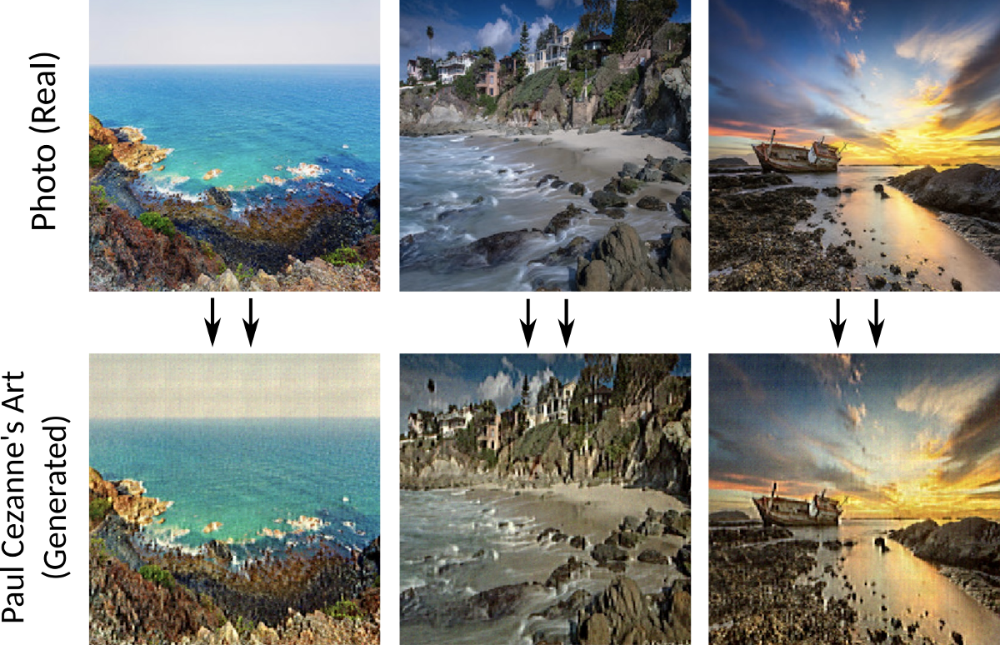
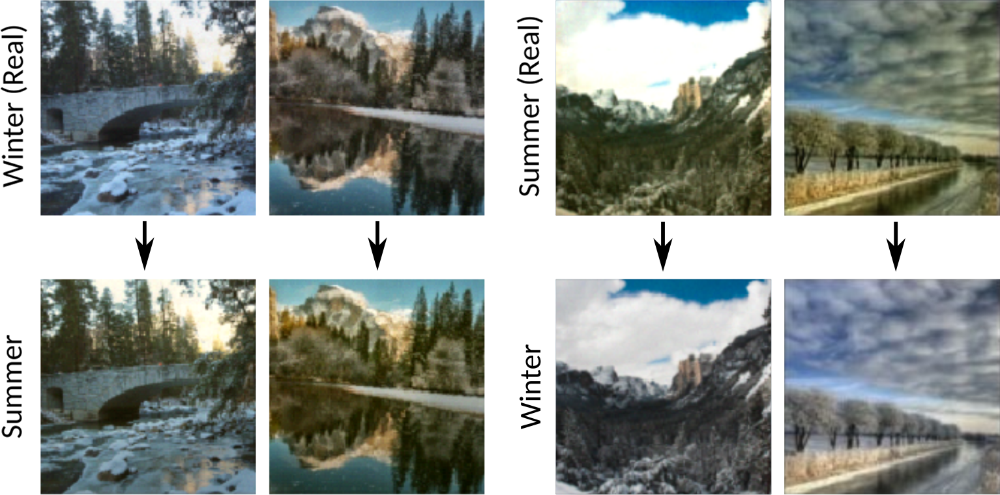

# Wasserstein-2 Generative Networks
This is the official `Python` implementation of the [ICLR 2021](https://iclr.cc) paper **Wasserstein-2 Generative Networks** (paper on [openreview](https://openreview.net/forum?id=bEoxzW_EXsa)) by [Alexander Korotin](https://scholar.google.ru/citations?user=1rIIvjAAAAAJ&hl=en), [Vahe Egizarian](https://scholar.google.ru/citations?user=Bktg6JEAAAAJ&hl=en), [Arip Asadulaev](https://scholar.google.com/citations?user=wcdrgdYAAAAJ&hl=ru), [Alexander Safin](https://scholar.google.com/citations?user=ga3P-mAAAAAJ&hl=en) and [Evgeny Burnaev](https://scholar.google.ru/citations?user=pCRdcOwAAAAJ&hl=ru).

The repository contains reproducible `PyTorch` source code for computing **optimal transport maps** (and distances) in high dimensions via the **end-to-end non-minimax** method (proposed in the paper) by using **input convex neural networks**. Examples are provided for various real-world problems: color transfer, latent space mass transport, domain adaptation, style transfer.

<p align="center"></p>

## Citation
```
@inproceedings{
  korotin2021wasserstein,
  title={Wasserstein-2 Generative Networks},
  author={Alexander Korotin and Vage Egiazarian and Arip Asadulaev and Alexander Safin and Evgeny Burnaev},
  booktitle={International Conference on Learning Representations},
  year={2021},
  url={https://openreview.net/forum?id=bEoxzW_EXsa}
}
```

## Prerequisites
The implementation is GPU-based. Single GPU (~GTX 1080 ti) is enough to run each particular experiment. Tested with

`torch==1.3.0 torchvision==0.4.1`

The code might not run as intended in newer `torch` versions. Newer `torchvision` might conflict with FID score evaluation.

## Related repositories
- [Repository](https://github.com/iamalexkorotin/Wasserstein2Barycenters) for [Continuous Wasserstein-2 Barycenter Estimation without Minimax Optimization](https://arxiv.org/abs/2102.01752) paper.

## Repository structure
All the experiments are issued in the form of pretty self-explanatory jupyter notebooks (`notebooks/`). For convenience, the majority of the evaluation output is preserved. Auxilary source code is moved to `.py` modules (`src/`). 

### Experiments
- `notebooks/W2GN_toy_experiments.ipynb` -- **toy experiments** (2D: Swiss Roll, 100 Gaussuans, ...);
- `notebooks/W2GN_gaussians_high_dimensions.ipynb` -- optimal maps between **Gaussians in high dimensions**;
- `notebooks/W2GN_latent_space_optimal_transport.ipynb` -- **latent space optimal transport** for generating [CelebA 64x64 aligned images](https://www.kaggle.com/jessicali9530/celeba-dataset);
- `notebooks/W2GN_domain_adaptation.ipynb` -- **domain adaptation** for *MNIST-USPS* digits datasets;
- `notebooks/W2GN_color_transfer.ipynb` -- cycle monotone pixel-wise image-to-image **color transfer** (example images are provided in `data/color_transfer/`);
- `notebooks/W2GN_style_transfer.ipynb` -- cycle monotone image dataset-to-dataset **style transfer** (used datasets are publicitly available at the official [CycleGan repo](https://github.com/junyanz/CycleGAN));
### Input convex neural networks
- `src/icnn.py` -- modules for Input Convex Neural Network architectures (**DenseICNN**, **ConvICNN**);
<p align="center"></p>

### Poster
- `poster/W2GN_poster.png` -- poster (landscape format)
- `poster/W2GN_poster.svg` -- source file for the poster
<p align="center"></p>

## Results
### Toy Experiments
Transforming single Gaussian to the mixture of 100 Gaussuans without mode dropping/collapse (and some other toy cases).
<p align="center"></p>

### Optimal Transport Maps between High Dimensional Gaussians
Assessing the quality of fitted optimal transport maps between two high-dimensional Gaussians (tested in dim up to 4096). The metric is **Unexplained Variance Percentage** (UVP, %).
<p align="center"></p>
<table>
<thead>
  <tr>
    <th></th>
    <th>2</th>
    <th>4</th>
    <th>8</th>
    <th>16</th>
    <th>32</th>
    <th>64</th>
    <th>128</th>
    <th>256</th>
    <th>512</th>
    <th>1024</th>
    <th>2048</th>
    <th>4096</th>
  </tr>
</thead>
<tbody>
  <tr>
    <td><a href="https://github.com/vivienseguy/Large-Scale-OT">Large-scale OT</a></td>
    <td>&lt;1</td>
    <td>3.7</td>
    <td>7.5</td>
    <td>14.3</td>
    <td>23</td>
    <td>34.7</td>
    <td>46.9</td>
    <td>&gt;50</td>
    <td>&gt;50</td>
    <td>&gt;50</td>
    <td>&gt;50</td>
    <td>&gt;50</td>
  </tr>
  <tr>
    <td><b>Wasserstein-2 GN</b></td>
    <td>&lt;1</td>
    <td>&lt;1</td>
    <td>&lt;1</td>
    <td>&lt;1</td>
    <td>&lt;1</td>
    <td>&lt;1</td>
    <td>1</td>
    <td>1.1</td>
    <td>1.3</td>
    <td>1.7</td>
    <td>1.8</td>
    <td>1.5</td>
  </tr>
</tbody>
</table>

### Latent Space Optimal Transport
CelebA 64x64 generated faces. The quality of the model highly depends on the quality of the autoencoder. Use `notebooks/AE_Celeba.ipynb` to train MSE or perceptual AE (on VGG features,  to improve AE visual quality).<br>
**Pre-trained autoencoders:** MSE-AE [[Goodle Drive](https://drive.google.com/file/d/1twsG6TbvlpQI7tkeScj7qoSVUs3K_1gq/view?usp=sharing), [Yandex Disk](https://yadi.sk/d/_fJ3wsAYzW3ORA)], VGG-AE [[Google Drive](https://drive.google.com/file/d/1p1LjGdOw7M3SQ1Zp1BiPKINaKZsOJ3RD/view?usp=sharing), [Yandex Disk](https://yadi.sk/d/BdWCkWuHogTzDQ)].
<p align="center"></p>
<p align="center"></p>

Combining simple pre-trained **MSE autoencoder** with W2GN is enough to surpass Wasserstein GAN model in Freschet Inception Distance Score (FID).

<table>
<thead>
  <tr>
    <th></th>
    <th>AE Reconstruct</th>
    <th>AE Raw Decode</th>
    <th><b>AE + W2GN</b></th>
    <th><a href="https://github.com/joeylitalien/celeba-gan-pytorch">WGAN</a></th>
  </tr>
</thead>
<tbody>
  <tr>
    <td><b>FID Score</b></td>
    <td>23.35</td>
    <td>86.66</td>
    <td><b>43.35</b></td>
    <td>45.23</td>
  </tr>
</tbody>
</table>

Perceptual **VGG autoencoder** combined with W2GN provides nearly State-of-the-art FID (compared to Wasserstein GAN with Quadratic Cost).

<table>
<thead>
  <tr>
    <th></th>
    <th>AE Reconstruct</th>
    <th>AE Raw Decode</th>
    <th><b>AE + W2GN</b></th>
    <th><a href="https://github.com/harryliew/WGAN-QC">WGAN-QC</a></th>
  </tr>
</thead>
<tbody>
  <tr>
    <td><b>FID Score</b></td>
    <td>7.5</td>
    <td>31.81</td>
    <td><b>17.21</b></td>
    <td>14.41</td>
  </tr>
</tbody>
</table>

### Image-to-Image Color Transfer
Cycle monotone color transfer is applicable even to gigapixel images!
<p align="center"></p>
<p align="center"></p>

### Domain Adaptation
MNIST-USPS domain adaptation. PCA Visualization of feature spaces (see the paper for metrics).
<p align="center"></p>

### Unpaired Image-to-Image Style Transfer
Optimal transport map in the space of images. Photo2Cezanne and Winter2Summer datasets are used.
<p align="center"></p>
<p align="center"></p>

## Credits
- [cycleGAN repo](https://github.com/junyanz/CycleGAN) with Winter2Summer and Photo2Monet datasets;
- [CelebA page](http://mmlab.ie.cuhk.edu.hk/projects/CelebA.html) with faces dataset and [this page](https://www.kaggle.com/jessicali9530/celeba-dataset) with its aligned 64x64 version;
- [pytorch-fid repo](https://github.com/mseitzer/pytorch-fid) to compute [FID](https://arxiv.org/abs/1706.08500) score;